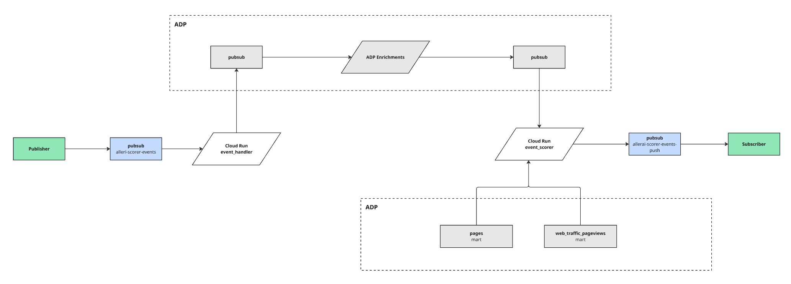
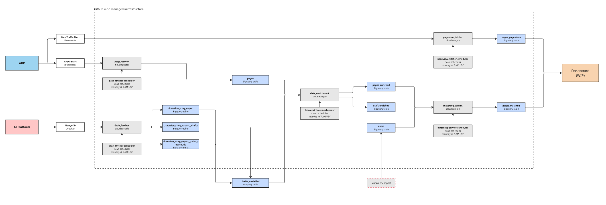

# Data Platform Repo

This repository contains **data pipelines, ML services, and infrastructure code** to fetch, model, and export data to the editorial ai platform. It is designed as a central hub for multiple integrations, each with its own pipeline, ML models, and deployment configuration.

---

## Integrations

This repo contains multiple integrations, which are explained later in this readme.

| Integration       | Description                                                                                                                       |
| ----------------- | --------------------------------------------------------------------------------------------------------------------------------- |
| **Integration A** | A two-part pipeline that ingests events, enriches them, and calculates relevance scores and traffic estimates for downstream use. |
| **Integration B** | Manages page drafts and published pages, along with a matching system to link published pages to drafts.                          |

---

## Event Scoring Integration

This repository contains the **Event Scoring Integration**, a two-part pipeline that ingests events, enriches them, and calculates relevance scores and traffic estimates for downstream use.

---

### 🚀 Overview

This integration can be visualized in below chart:


The integration mainly consists of **two connected services**:

### 1. Event Handler

- **Pub/Sub** receives incoming events from authorized sources.
- **Event Handler Cloud Run service**:
  - Parses incoming events.
  - Performs sanity checks and data validation.
  - Ensures required fields are present.
- Valid events are forwarded to the **Aller Data Platform (ADP)**.
- ADP enriches events with:
  - Embeddings
  - Classifications (Google content categories)
  - Entity recognition (WIP)
- ADP then publishes enriched events to **Event Scorer Cloud Run service**, triggering the second part of the pipeline.

### 2. Event Scorer

- Consumes enriched events from **ADP**.
- Fetches comparison events from **ADP / BigQuery** (with caching for efficiency).
- Computes **three feature types** for the event against comparison events:
  1. **Similarity** (via embeddings)
  2. **Classification overlap** (Google categories)
  3. **Entity matching** (person / tag overlap) -
- Calculates **per-site relevance scores** using weights domain specific weights defined in `domain_scoring.yaml`.
- Retrieves historical traffic data from ADP to:
  - Estimate potential traffic.
  - Place the event into a **traffic quartile**.
- Pushes a **scored payload** to pubsub for downstream consumption.

## Configuration

### Domain Scoring

Scoring behavior is configurable via `event_scorer/models/domain_scoring.yaml`, which defines per-domain weights for:

- Similarity
- Classification overlap
- Entity/tag matching

Features can be set as type "weighted" or "additive", with weighted being weighted against other weighted features.
Additive scores are added on top of the weighted features.

### Traffic Estimation

Uses historical traffic numbers from ADP to estimate pageview ranges.

---

### ✅ Output

Each event processed by the integration produces a **scored payload** containing features for each domain:

```yaml
id: <event_id>
site_domain: <target_domain>
relevance_score: <weighted_score>
potential_quartile: <quartile_label>
pageview_range: <estimated_range>
person_tags: <recognized_entities>
```

---

### 🛠️ Tech Stack

- **Google Cloud Pub/Sub** – Event transport
- **Google Cloud Run** – Ingestion and validation service
- **Aller Data Platform (ADP)** – Event enrichment (embeddings, categories, entities)
- **BigQuery** – Storage of enriched events, historical traffic, and comparison events
- **Python** – Event Scorer implementation

### 📝 Usage

### 1. Publishing an Event

You need to publish your event to the **provided Pub/Sub topic** using an authorized **Service Account (SA)**.

Required fields in the payload are:

```json
["id", "published", "site", "teaser", "title", "body"]
```

The payload can be a flat JSON object or a list of objects with these values.

```json
{
  "id": "article-123",
  "published": "{'$date': '2024-05-03T19:00:00.000Z'}",
  "site": "example.com",
  "teaser": "This is a short teaser.",
  "title": "Example Article Title",
  "body": "Full article body text goes here."
}
```

### 2. Receiving Results

To consume scored events, you must provide an HTTP endpoint capable of receiving the results via POST requests.

The integration will deliver a scored payload in the following structure:

```json
{
  "id": "article-123",
  "site_domain": "example.com",
  "relevance_score": 0.87,
  "pageview_range": [37976, 48826],
  "potential_quartile": 1,
  "person_tags": ["Person A", "Person B"]
}
```

## 📄 Aller AI Platform Matching

This repository contains data pipelines and supporting code for managing page drafts and published pages, along with a matching system to link published pages to drafts.

### Repository Structure

- **`images/jobs/draft_fetcher`**  
  Pipeline for fetching article drafts from the AI platform. This pipeline extracts draft data and loads it into **Bigquery**.

- **`images/jobs/page_fetcher`**  
  Pipeline for fetching published pages from various brand sites. This pipeline extracts published pages and loads it into **Bigquery**.

- **`images/jobs/pageviewfetcher`**  
  Pipeline for fetching pageviews from pages from various brand sites. This pipeline extracts pageviews and loads it into **Bigquery**.

- **`images/jobs/data_enrichment`**  
  Pipeline for vectorizing pages and drafts. This pipeline extracts published pages and drafts and enriches them, then loads it into **Bigquery**.

- **`images/jobs/matching_service`**  
  Python code for matching published pages with drafts.

### Deployment

All pipelines are containerized using Docker and deployed on Google Cloud Run. The deployment and configuration details are managed via GitHub Actions workflows, defined in the repository’s `.github/workflows/` directory.

---

### Getting Started

1. **Docker & Cloud Run**  
   Build and deploy containers using the provided GitHub workflows or manually via Docker and `gcloud` CLI.

2. **Configuration**  
   Deployment settings and environment variables are configured in GitHub workflow YAML files.
   Variables are stored as github secrets.

---

### Additional Information

- The pipelines leverage the [dlt](https://dlt.dev/) framework for efficient and incremental data loading.
- The matching code helps maintain consistency between draft content and live published pages for better editorial workflow insights.

### 🗺️ Application Flow

Here is a visual overview of the application's workflow:

[](https://miro.com/app/board/uXjVIl8bjrA=/?share_link_id=847040207386)

_Click the image to open the full interactive Miro board._
